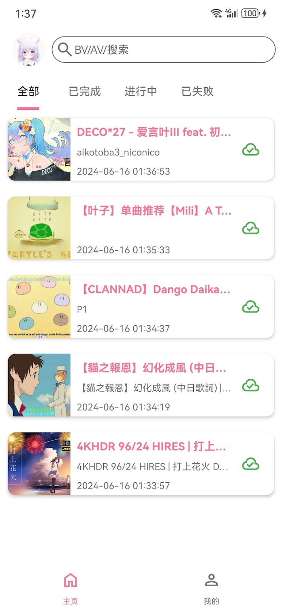
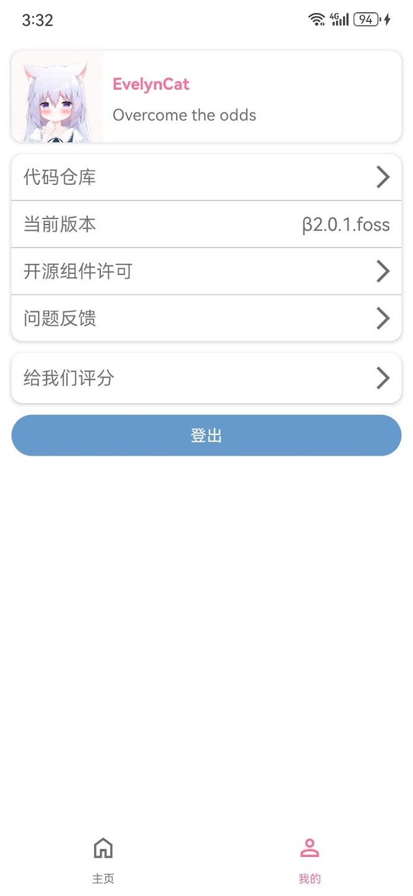
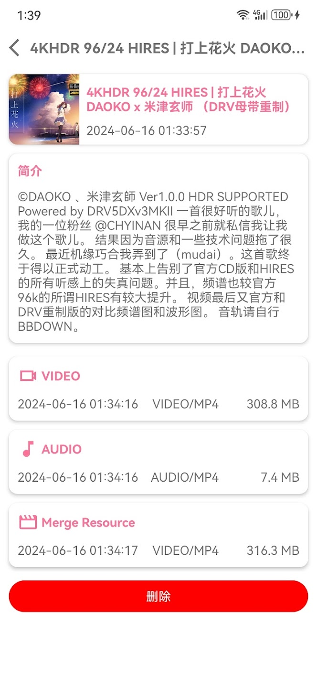
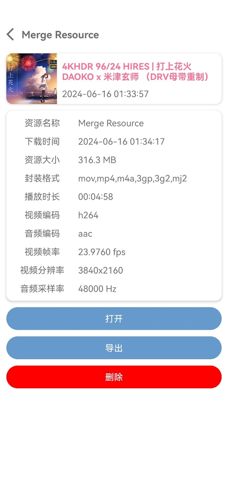

# BiliDownload
 支持下载bilibili所有视频(用户上传的视频、番剧、电视剧、电影)  
 支持提取视频文件音频(aac)  
 支持转换视频封装格式(flv、mp4、mkv、wmv)  
 
  
  or [Releases](https://github.com/KafuuNeko/BiliDownload/releases)
 
# 如何下载
 直接搜索相关视频或者将bilibili视频地址(也可以是分享链接、BV、AV、EP、SS)复制粘贴到搜索输入框点击搜索  
 部分视频以及720p以上的分辨率需登录bilibili账号后下载    

 

  
 登录后可在解析页点击头像处进入个人信息页面查看您的历史记录、收藏夹、番剧点击指定视频可直接下载 
 
  
 
  
# 下载后  
 点击相关资源可进入资源管理页导出或者删除下载指定资源  

   
 
