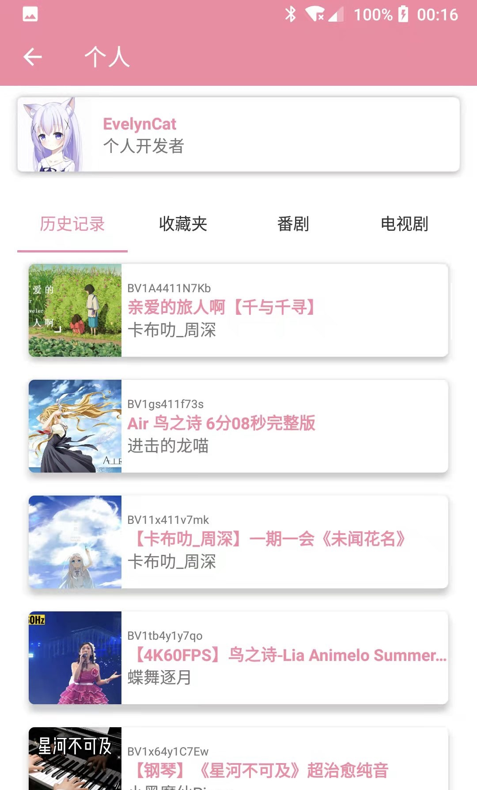
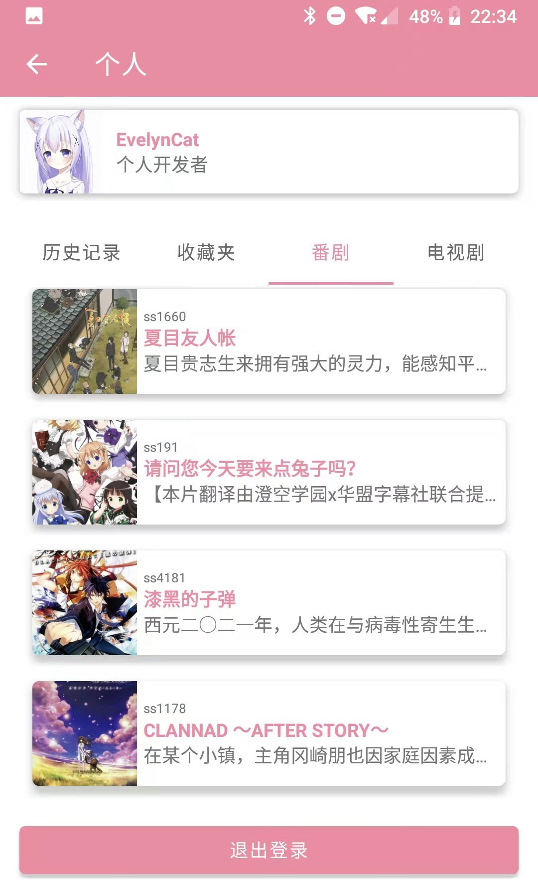
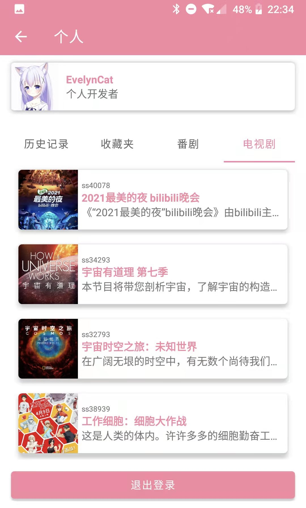
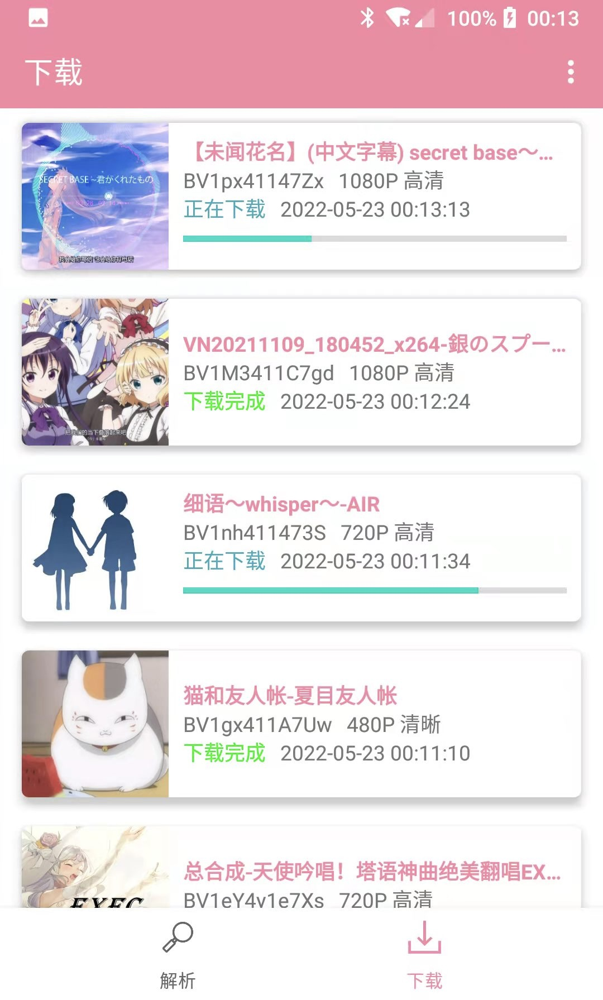
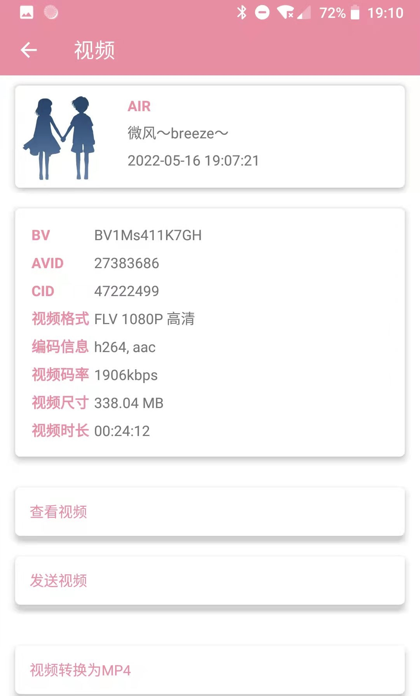
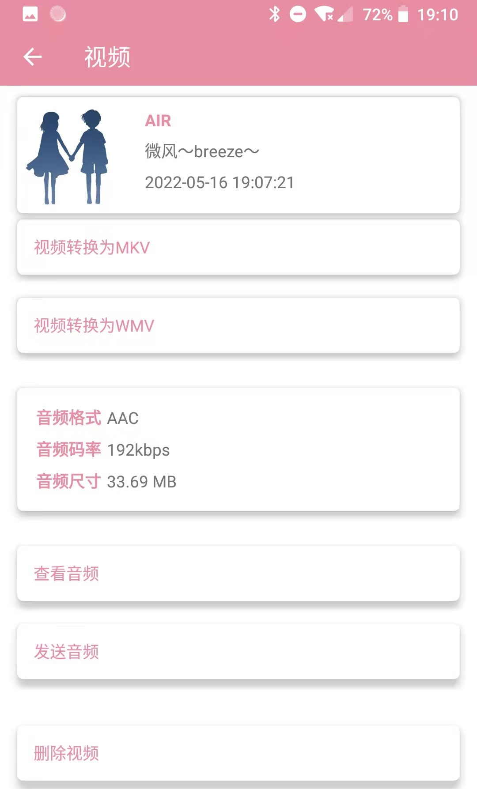

# BiliDownload
 支持下载bilibili所有视频(用户上传的视频、番剧、电视剧、电影)  
 支持提取视频文件音频(aac)  
 支持转换视频封装格式(flv、mp4、mkv、wmv)  
 
 
 
# 如何下载
 将bilibili视频地址(也可以是分享链接、BV、AV、EP、SS)复制粘贴到解析页输入框点击解析  
 部分视频以及720p以上的分辨率需登录bilibili账号后下载    

 

  
 登录后可在解析页点击头像处进入个人信息页面查看您的历史记录、收藏夹、番剧、电视剧列表，点击指定视频可直接下载 
 
     
 
  
# 下载后  
    

 在下载页选中已下载项目可进入对应的下载项管理页  

   
 
